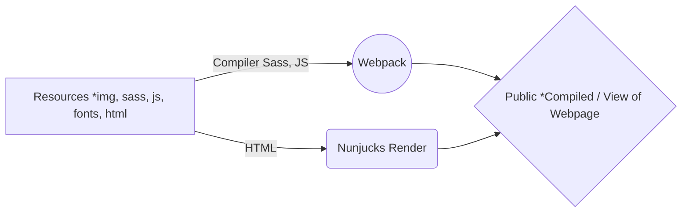

# Sopi Septiansyah

Download this Resources and follow the guide :

 1. In command line type 
 
> npm install

 2. If show error, upgrade native to version v1.1.6
 
> npm install natives@1.1.6

3. And then run development and access http://localhost:3000 for development

> npm run dev
 
 For production just run
> npm run prod

**This resources built in :**

 - Bootstrap 4 ( https://getbootstrap.com/ )
 - jQuery
 - FontAwesome (https://fontawesome.com/)
 - Owl  Carousel ( https://owlcarousel2.github.io/OwlCarousel2/ ) *optional
 - Magnific Popup ( https://dimsemenov.com/plugins/magnific-popup/ )  *optional
 

And this is flowchart of the produce:

*Thank you,*
**Sopi Septiansyah**

